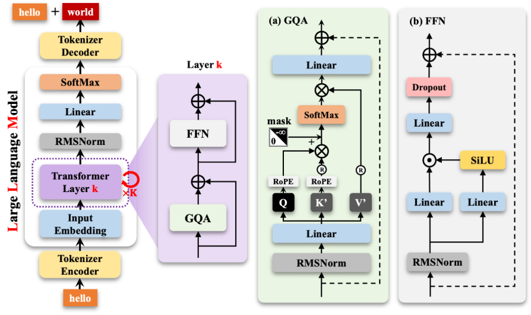
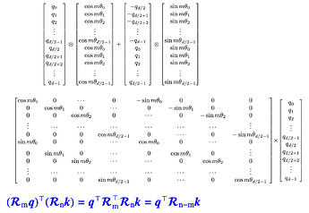
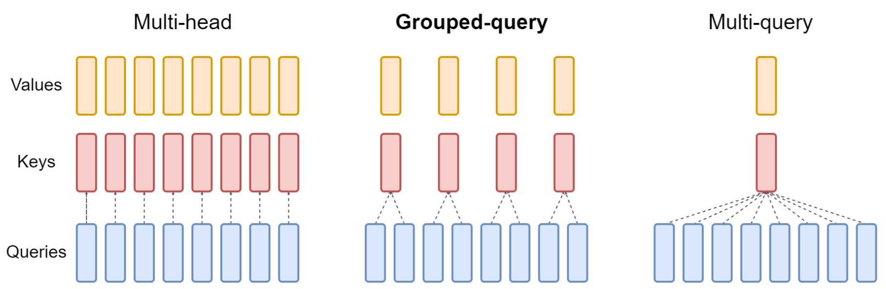

# nano-LLM
组里要我们看看cs224n的课，然后在暑假展示一下学习成果，于是这个项目就诞生了。目前参考[minimind](https://github.com/jingyaogong/minimind )准备做一个简单的小LLM来看看效果，后续可能会加入MOE和多模态。

## Model Structure

### Ⅰ RMSNorm
这个模块主要是用来进行归一化，主要作用是稳定神经网络的训练过程，通过对每一层的输入（即hidden_states）进行归一化，使其保持在一个固定的尺度范围内，从而帮助模型更稳定、更快速地收敛。
根据以下公式实现：
$$
\text{RMSNorm}(x) = \frac{x}{\sqrt{\frac{1}{n} \sum_{i=1}^{n} x_i^2 + \epsilon}} \cdot \gamma
$$
- $x$ 是输入向量。
- $\frac{1}{n} \sum_{i=1}^{n} x_i^2$ 是均方根（RMS）的计算。
- $\epsilon$ 是一个小的常数，用于数值稳定性。
- $\gamma$ 是可学习的缩放因子。

### Ⅱ Rotary Positional Embedding（RoPE）
旋转位置嵌入（Rotary Positional Embedding, RoPE）可以向 Transformer 的自注意力（Self-Attention）机制中注入位置信息，具体实现方式可以参看下图，也可以通过[B站视频](https://www.bilibili.com/video/BV1Mj421R7JQ?spm_id_from=333.788.videopod.sections&vd_source=9da1847985aca3a04bc1b7451f13712e)了解。

### Ⅲ Grouped-Query Attention (GQA)

#### Multi-Head Attetion
多头注意力只需要按照num_heads做一个投影即可，结构如右图所示。

## 目录文件
- LLM相关
    - pretrain.py: 预训练脚本，用于预训练LLM
    - sft_train.py: 微调脚本，训练LLM，主要是训练对话风格
    - moe_train.py: MOE模型的训练脚本
    - config.py: 配置文件，包含模型参数和训练参数
    - inference.py: 推理脚本，用于生成文本
- MMLM相关
    - multi_mode_pretrain.py: 多模态预训练脚本
    - multi_mode_sft.py: 多模态sft脚本
    - gradio_mmlm.py: 多模态gradio界面
- 数据处理相关
    - dataset.py: 数据集类定义
    - train_tokenizer.py: 分词器训练

